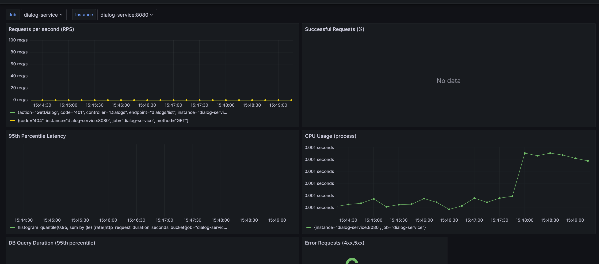

Система мониторинга (Prometheus, Zabbix, Grafana) позволяет не только визуализировать метрики, но и настраивать оповещения (alerts) при выходе определенных показателей за допустимые пределы.

## Компоненты и их роли в Alerting

1.  **Prometheus:**
    *   **Сбор метрик:** Собирает бизнес-метрики (RED) с `DialogService` (и потенциально других сервисов) через эндпоинт `/metrics`.
    *   **Правила оповещений (Alerting Rules):** В Prometheus можно определить правила (в формате YAML), которые описывают условия срабатывания оповещений на основе собранных метрик (например, высокий уровень ошибок, большое время ответа).
    *   **Alertmanager (Не развернут):** Prometheus обычно интегрируется с отдельным компонентом Alertmanager, который отвечает за дедупликацию, группировку, маршрутизацию и отправку оповещений через различные каналы (Email, Slack, PagerDuty и т.д.). *В текущей конфигурации `docker-compose.yml` Alertmanager не развернут, но его можно добавить при необходимости.*.

2.  **Zabbix:**
    *   **Сбор метрик:** Собирает технические метрики (CPU, RAM, сеть, диск, состояние процессов/контейнеров) с хоста/контейнера `dialog-service-container` с помощью Zabbix Agent.
    *   **Триггеры (Triggers):** В Zabbix определяются триггеры, которые описывают проблемные состояния на основе собранных метрик (например, загрузка CPU > 90%, мало свободного места на диске, сервис недоступен).
    *   **Действия (Actions):** Zabbix Actions определяют, что делать при срабатывании триггера: отправить уведомление (Email, SMS, скрипт и т.д.), выполнить команду и т.п.

3.  **Grafana:**
    *   **Визуализация:** Отображает метрики из Prometheus и Zabbix.
    *   **Grafana Alerting:** Grafana имеет собственный встроенный механизм оповещений. Он позволяет создавать правила оповещений прямо из панелей дашбордов или в отдельном разделе Alerting.
    *   **Источники данных:** Grafana Alerting может использовать данные как из Prometheus, так и из Zabbix (через соответствующий плагин) для определения условий срабатывания.
    *   **Каналы уведомлений (Notification Channels/Contact Points):** Grafana позволяет настроить различные каналы для отправки уведомлений (Email, Slack, Webhook и т.д.).

## Сценарии настройки оповещений

В текущей конфигурации наиболее удобным способом настройки оповещений является **Grafana Alerting**, так как она может работать с данными из обоих источников (Prometheus и Zabbix) и имеет гибкие настройки уведомлений.

**Пример настройки оповещения в Grafana:**

1.  **Создание правила:**
    *   Перейти в раздел `Alerting` в Grafana.
    *   Нажать `New alert rule`.
    *   **Запросы (Queries):** Выбрать источник данных (Prometheus или Zabbix) и определить запрос для метрики, которую нужно отслеживать (например, `sum(rate(http_server_requests_seconds_count{job="dialog-service", outcome!="SUCCESS"}[5m]))` для частоты ошибок из Prometheus).
    *   **Условия (Conditions):** Задать условие срабатывания (например, `WHEN last() OF query(A, 5m) IS ABOVE 0.1` - если частота ошибок выше 0.1 в течение 5 минут).
    *   **Детали оповещения (Alert details):** Задать имя, сообщение, теги.
    *   **Уведомления (Notifications):** Связать правило с точкой контакта (Contact Point), которая определяет, куда отправлять уведомление (например, Email).
2.  **Настройка точек контакта (Contact Points):**
    *   Перейти в раздел `Alerting` -> `Contact points`.
    *   Создать новую точку контакта, выбрав тип (Email, Slack и т.д.) и указав необходимые реквизиты.

## Пример дашборда с метриками (Место для вашего скриншота)
 
  

