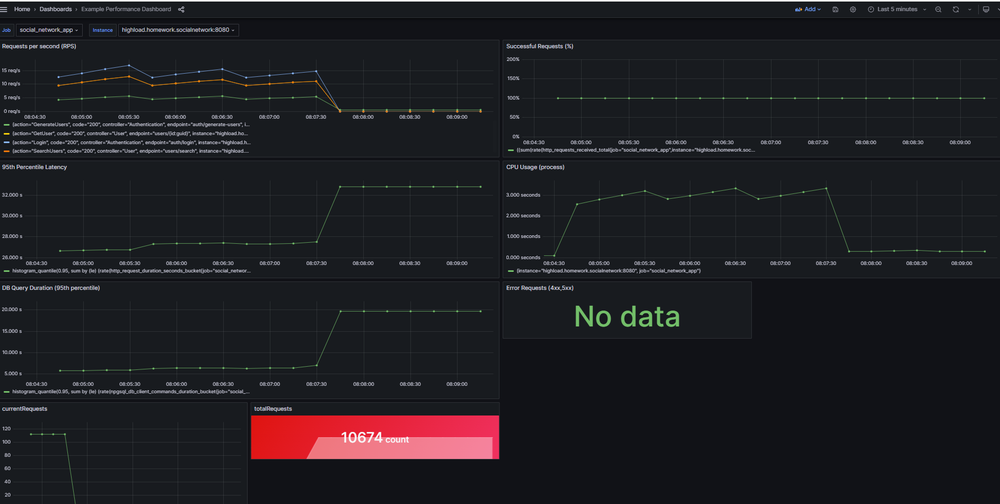
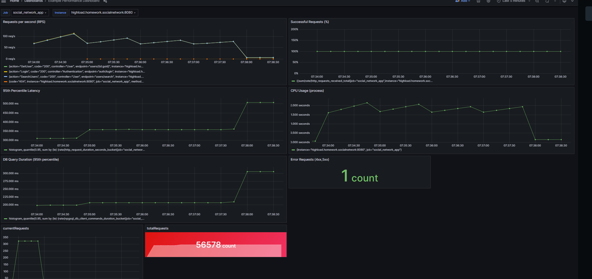
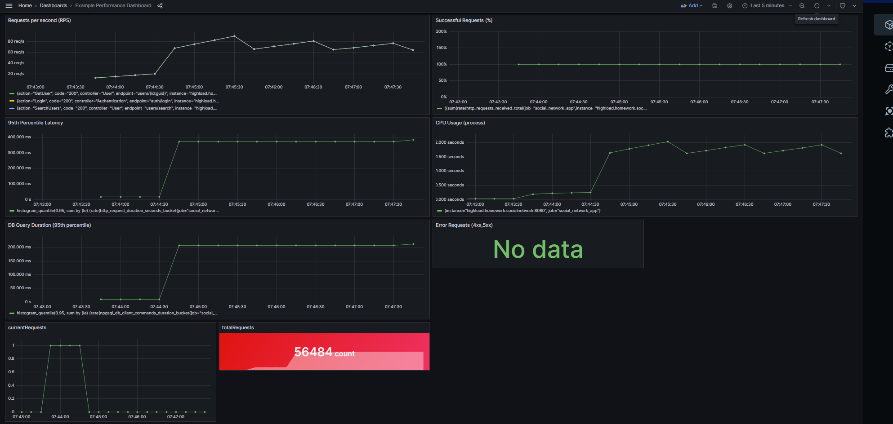

# Отчет о проделанной работе

## Настройка репликации

Была развернута кластерная конфигурация на базе PostgreSQL, включающая один мастер и два слейва. Репликация настроена в режиме физической репликации, что позволило поддерживать актуальное состояние слейвов в реальном времени. Изначально все запросы (чтение и запись) обрабатывались мастером.

Для разгрузки мастера была реализована логика маршрутизации: операции записи оставались на мастере, а запросы чтения перенесены на слейвы. Это обеспечило более равномерное распределение нагрузки и повысило производительность системы.

## Перенос запросов на чтение на слейвы

Для двух операций чтения (например, получение пользователя по ID и поиск пользователей) запросы были направлены на слейвы. Таким образом, мастер стал меньше нагружен операциями чтения, сосредоточившись на записях, а это уменьшило время отклика под нагрузкой.

## Нагрузочное тестирование

Для оценки эффективности были использованы k6, Prometheus и Grafana.

- **Первый скриншот (одновременное чтение и запись, затем отключение слейва и промоут в мастер):**  
  
  На этом этапе все операции шли на один узел (сначала мастер, затем при отключении слейва и его промоутировании снова один узел). Это приводило к росту задержек при увеличении нагрузки.

- **Второй скриншот (1 мастер - 2 слейва для чтения):**  
  
  Здесь запросы на чтение были распределены между двумя слейвами. На графиках видно более стабильный рост RPS и более низкую латентность под нагрузкой. Распределение чтений на слейвы позволило эффективнее масштабировать систему.

- **Третий скриншот (1 мастер, чтение тоже на мастере):**  
  
  Когда все запросы (чтение и запись) идут на один мастер, увеличивается латентность при возрастании нагрузки, так как узел вынужден обрабатывать всё сразу.

## Эксперимент с отказом мастера

Был проведен эксперимент по аварийной остановке мастера. При промоутировании слейва до мастера потеря подтверждённых транзакций не была зафиксирована. Это свидетельствует о корректной работе репликации и отсутствии критических потерь данных при переключениях.

## Итоги

- Настройка репликации позволила вынести запросы чтения на слейвы, снижая нагрузку на мастер.
- Нагрузочное тестирование показало, что распределение чтения между слейвами улучшает отклик системы и её масштабируемость.
- При аварийной остановке мастера не было потеряно подтверждённых транзакций, система смогла продолжить работу, промоутировав слейв в мастер.
